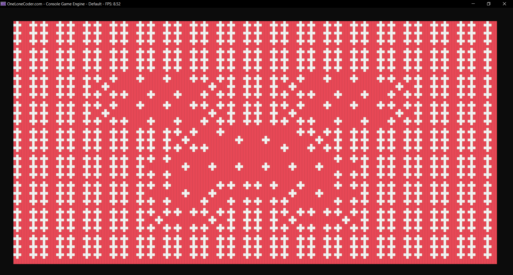

# DiceImage
Attempt at creating system for representing any image using dice with impressively shitty results.

Using shortened image.h library from school professor and olcConsoleGameEngine from javidx9 https://github.com/OneLoneCoder

## Sample
Original          |  Result
:-------------------------:|:------------------------------:
  |  

## Comments
- So far due to resolution it is only "accurate" for images with broad blocks of contrasting colours
- Doesn't work very well with Windows terminal app for some reason
- Not very well commented

## Further Work
- More resolution
- Figure out why it doesn't work with Windows terminal app
- Make image input UI to make it easier to work with
- Make system to enable actually building the image e.g. statistics on number of each dice necessary.

## Requirements
Requires libpng library

To install library run: .\vcpkg install libpng

Dont have vcpkg package manager: follow https://www.studyplan.dev/b/vcpkg-windows to install
